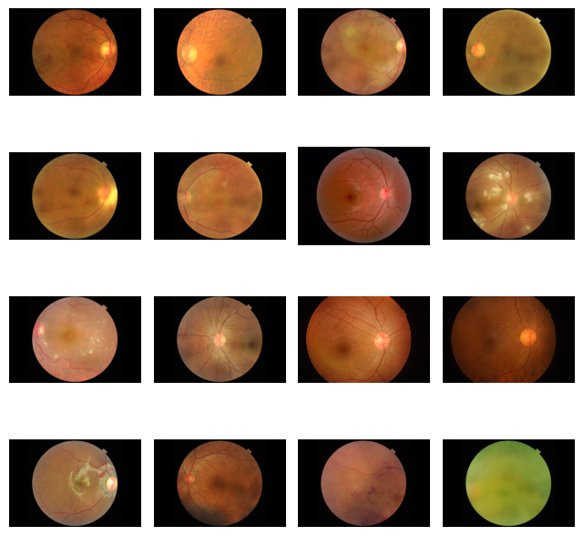
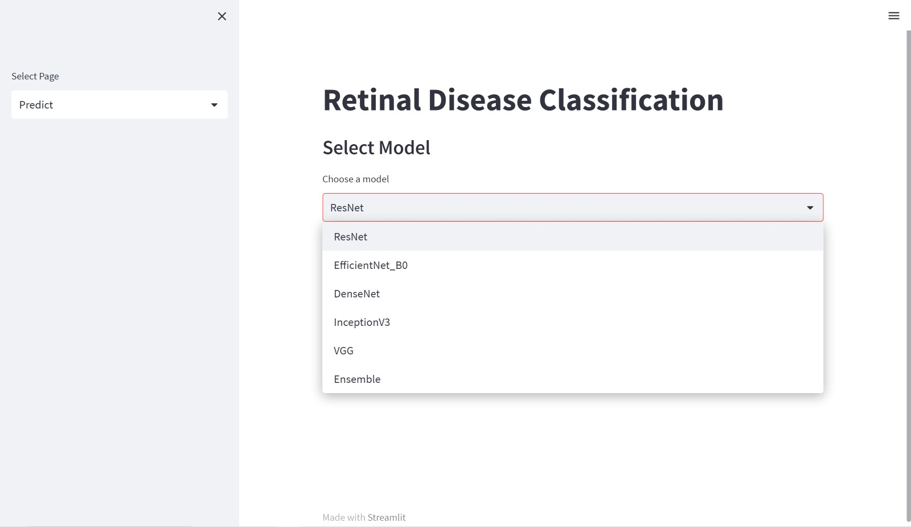
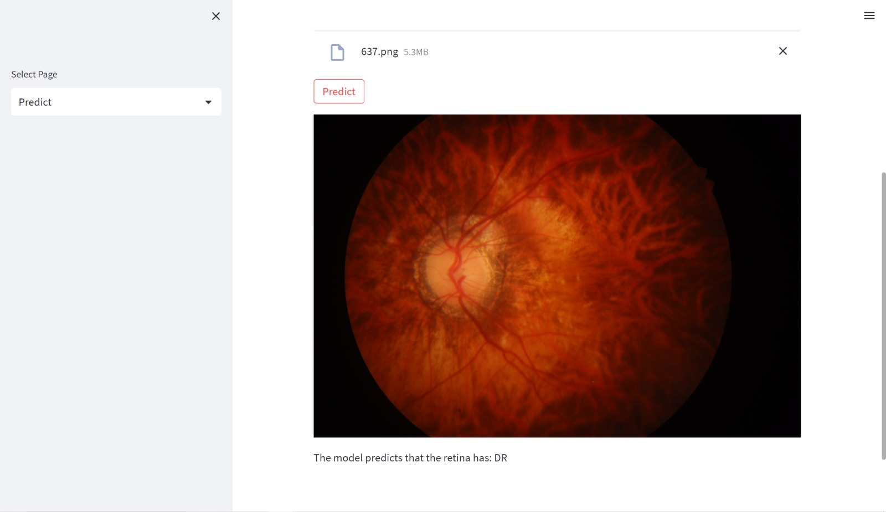

# Retinal-Disease-Classification

## PROBLEM STATEMENT:

- The retina is a thin layer of tissue at the back of the eye responsible for
detecting light and sending visual signals to the brain. Retinal diseases
are a group of conditions that affect the retina, leading to vision loss
and blindness if left untreated.

- Many types of retinal diseases exist, including age-related macular
degeneration (AMD), diabetic retinopathy, retinal detachment, and
retinitis pigmentosa. These diseases can be caused by a variety of
factors, such as genetics, aging, and underlying health conditions like
diabetes.

- Early diagnosis and treatment of retinal diseases are essential for
preventing vision loss and preserving visual function. Traditional
methods for diagnosing retinal diseases involve ophthalmoscopy,
fluorescein angiography, and optical coherence tomography (OCT).
However, these methods can be time-consuming, and expensive, and
require highly trained professionals to interpret the results.


## Dataset: ([Kaggle](https://www.kaggle.com/datasets/andrewmvd/retinal-disease-classification))

- The Retinal Fundus Multi-disease Image Dataset (RFMiD)
is a set of images of the retina taken with three different fundus
cameras and labeled with 46 different retinal diseases by two
top retinal experts. There are a total of 3200 fundus pictures
in the collection. Each image is labeled with one or more of
46 different retinal conditions, such as AMD, DR, glaucoma,
and hypertensive retinopathy.



## Models:

- ResNet50
- VGG16
- Inception-v3
- EfficientNet B0
- DenseNet 121

All the pre-trained models are used for training on the dataset.

we used a combination of five pre-trained models (ResNet50, VGG16, Inception-v3, EfficientNet B0, and DenseNet 121) to classify retinal diseases from the Retinal Fundus Multi-disease Image Dataset. We fine-tuned the pre-trained models on our dataset and combined their predictions using a **weighted ensemble method**. We achieved an overall accuracy of **90.7%** using this approach.


## Deployment:
### Streamlit

Streamlit is a Python-based library that allows the creation and deployment of machine learning web applications. It is also fast and flexible, turning application development time from days into hours.

Use any IDE to run the code.

- Download all the requirements from the ```requirements.txt``` file using 
 ```pip install -r requirements.txt```

- We need to download all the pickle files of the models (the code can be accessed here [code](https://github.com/sharmila139/Retinal-Disease-Classification/blob/main/DLOPs_Models.ipynb))

```
import pickle
pickle_out = open("emp-model-resnet.pkl","wb")
pickle.dump(model, pickle_out)
pickle_out.close()
```

- Run the app using the command:
 ```streamlit run testml.py```
 
 
 - Select the required model from the options and upload the image to predict the disease.


 
